# Movies App

## Overview

This is an Android movie app that provides details about movies. It fetches data from the TMDB (The Movie Database) API and displays movie information, including similar movies and cast details.

## Preview

Preview images

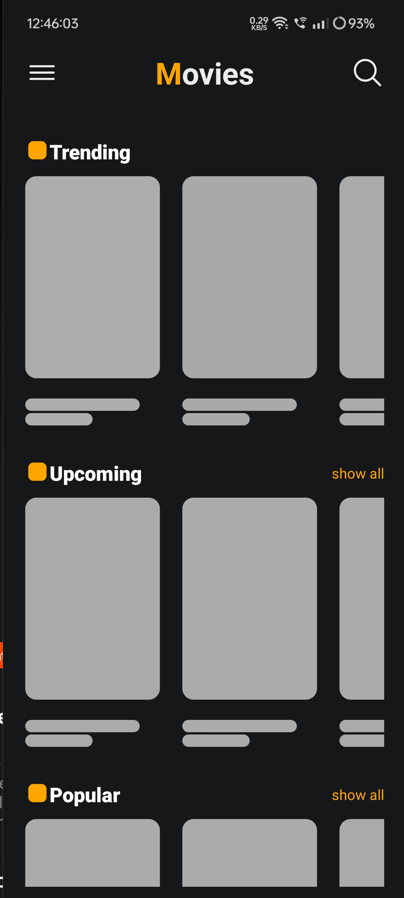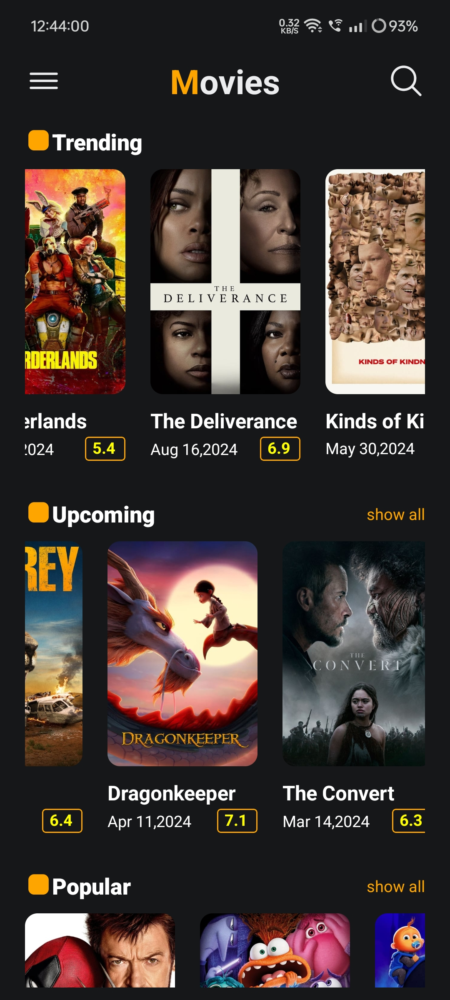
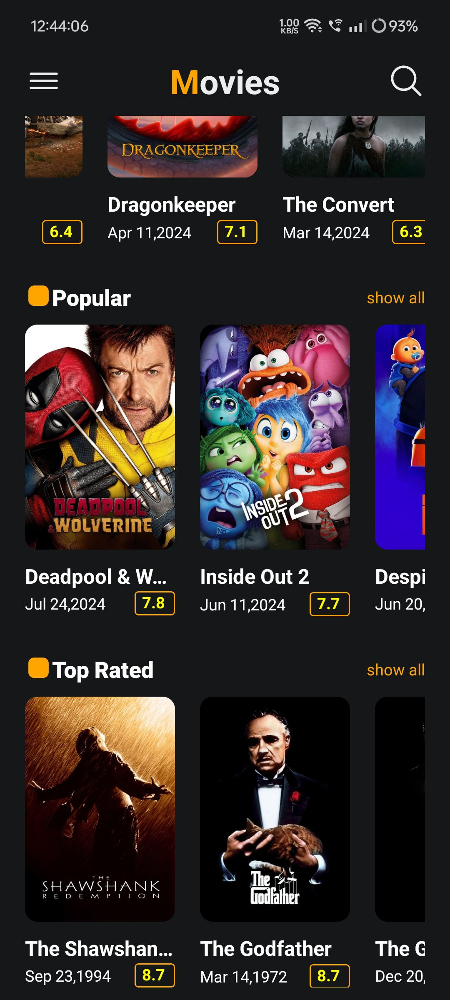
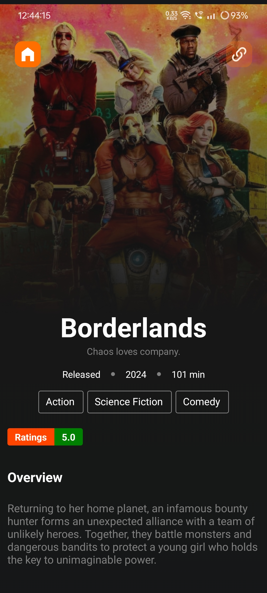
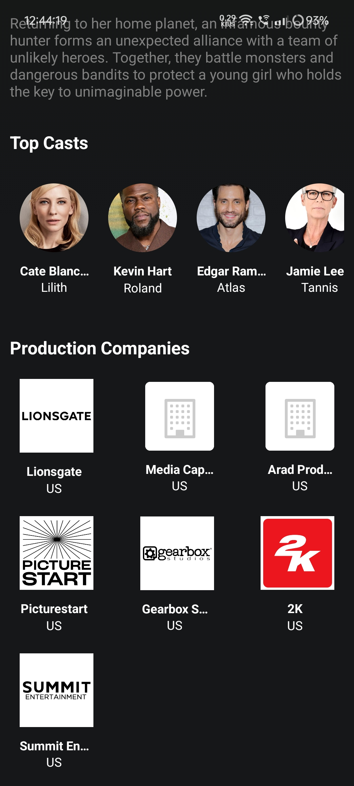
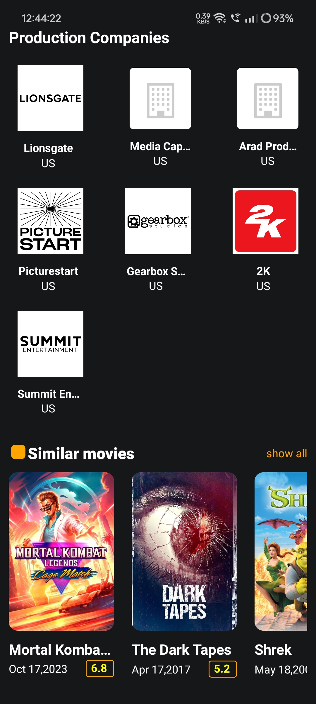
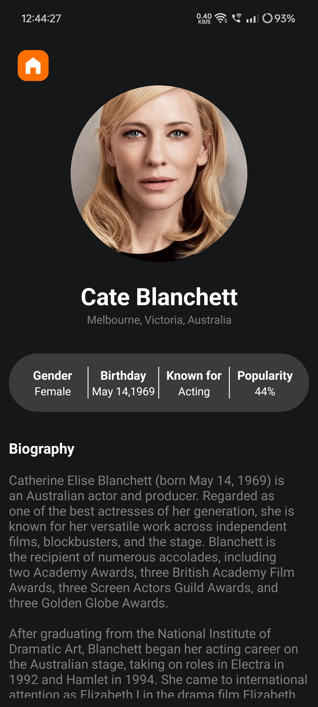
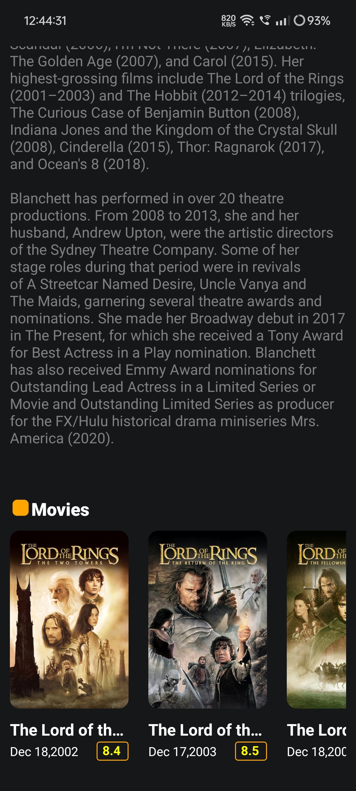
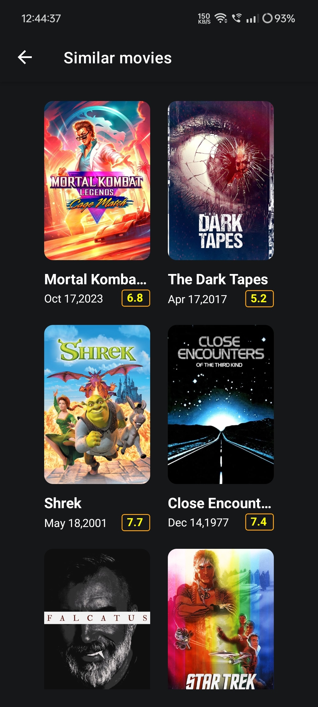
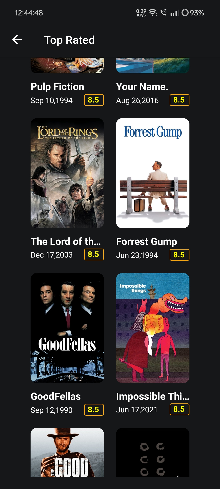
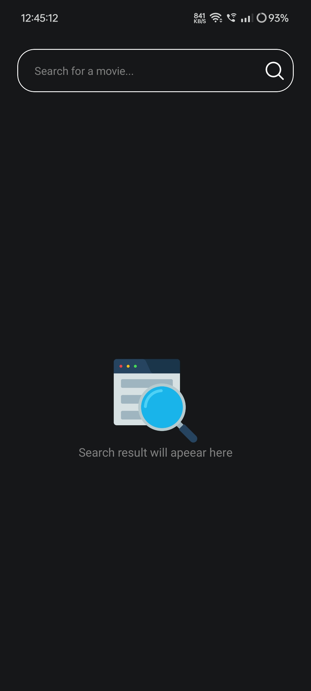
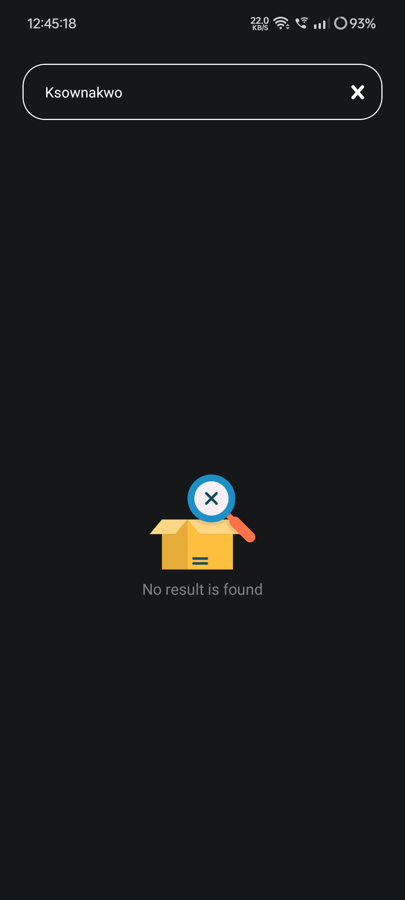
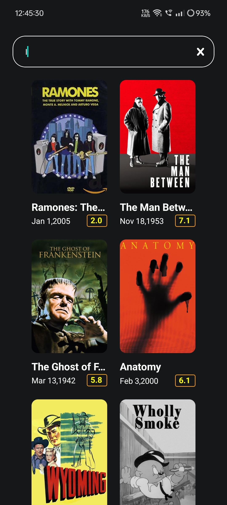
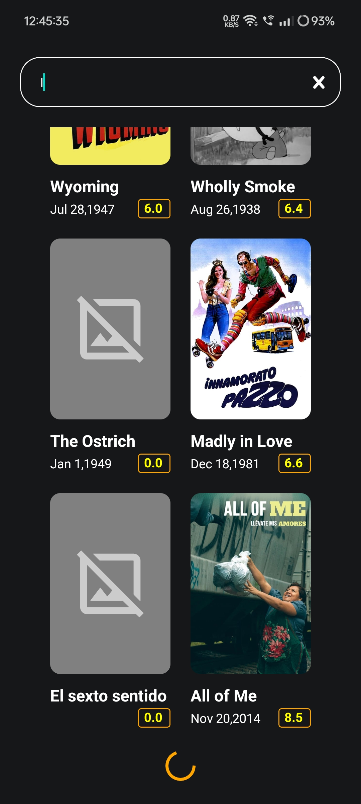

## Download


## Getting Started

To set up and run this project locally, follow these steps:

### Prerequisites

- **Node.js**: Ensure you have Node.js installed on your machine.
- **Expo CLI**: Install Expo CLI if you haven't already. You can install it globally using npm:

  ```bash
  npm install -g expo-cli
  ```

### Clone the Repository

1. Clone the repository from GitHub:

   ```bash
   git clone https://github.com/RanitJana/Movies-app.git
   ```

2. Navigate into the project directory:

   ```bash
   cd Movies-app
   ```

### Set Up Environment Variables

1. Create a `.env` file in the root of the project directory.

2. Add your TMDB API key to the `.env` file:

   ```env
   EXPO_PUBLIC_MOVIE_KEY=YOUR_TMDB_API_KEY
   ```

   Replace `YOUR_TMDB_API_KEY` with your actual API key from TMDB.

### Run the App

Run the below one and automatically it'll install all the dependencies and start the server:

```bash
bash start.sh
```

That's it!
